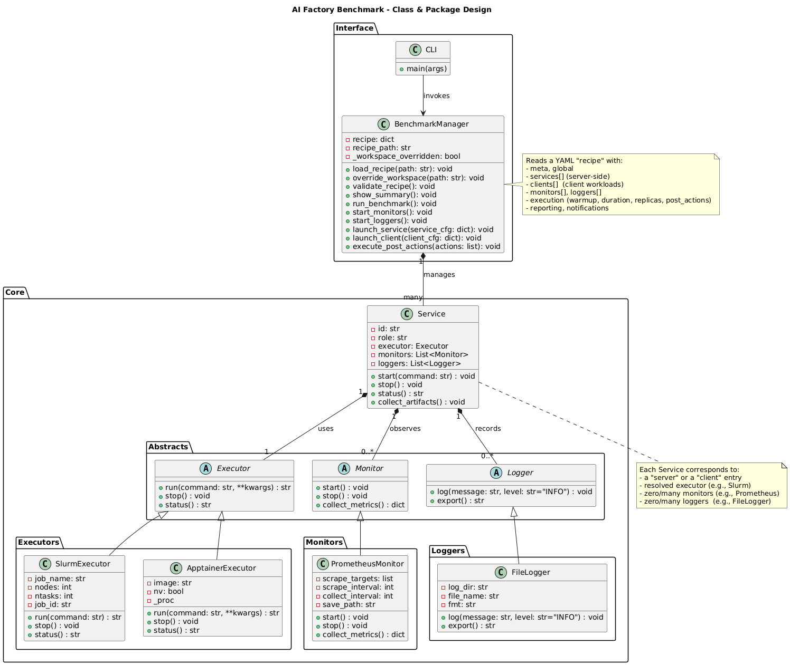

# Benchmarking-AI-Factories

A modular benchmarking framework for evaluating AI Factory components on HPC systems. Designed for the EUMaster4HPC Student Challenge 2025-2026 on the MeluXina supercomputer.

## Overview

This framework provides automated benchmarking of:
- Inference servers (vLLM)
- Object storage (MinIO/S3)

Results are collected via Prometheus metrics and visualized in Grafana dashboards.

## Architecture

The following diagram shows the system architecture:



## Requirements

### Local Machine (Windows WSL / Linux)

- Docker Desktop (with WSL2 integration if on Windows)
- SSH access to MeluXina configured in ~/.ssh/config
- Git
- rsync

### MeluXina Cluster

- Apptainer module (loaded automatically by scripts)
- Python 3.9+
- Access to GPU partition for vLLM benchmarks

## Project Structure

```
Benchmarking-AI-Factories/
├── Recipes/                    # YAML benchmark configurations
│   ├── vLLM_InferenceRecipe.yaml
│   └── S3_UploadRecipe.yaml
├── scripts/
│   ├── automation_script.sh    # Main entry point (run from local)
│   ├── build_images_local.sh   # Build Apptainer images locally
│   └── pull_images_meluxina.sh # Build images on cluster
├── src/
│   ├── Interface/
│   │   ├── cli.py              # Command-line interface
│   │   ├── benchmark_manager.py
│   │   └── fastapi_server.py   # Grafana datasource API
│   └── Core/
│       ├── executors/          # Slurm, Process, Apptainer
│       ├── monitors/           # Prometheus metrics collection
│       ├── loggers/            # File logging
│       └── workloads/          # vllm_inference.py, s3_upload.py
├── run_benchmark.sh            # Slurm job script
├── images/                     # Pre-built Apptainer SIF images
└── docs/
    └── design.puml             # Architecture diagram
```

## Usage

### Option 1: Automated Workflow (Recommended)

Run everything from your local machine:

```bash
cd Benchmarking-AI-Factories/scripts
bash automation_script.sh
```

This script will:
1. Sync the project to MeluXina
2. Submit the Slurm job
3. Wait for completion
4. Fetch results to local machine
5. Start Grafana dashboard

### Option 2: Manual Execution on MeluXina

1. SSH into MeluXina:
   ```bash
   ssh meluxina
   ```

2. Navigate to project directory:
   ```bash
   cd /project/scratch/p200981/$USER/benchmarks/Benchmarking-AI-Factories
   ```

3. Submit the benchmark job:
   ```bash
   sbatch run_benchmark.sh
   ```

4. Monitor job status:
   ```bash
   squeue -u $USER
   ```

## Configuration

### Changing the Benchmark Type

Edit `run_benchmark.sh` and modify the `RECIPE_PATH` variable:

```bash
# For vLLM inference benchmark
RECIPE_PATH="${PROJECT_DIR}/Recipes/vLLM_InferenceRecipe.yaml"

# For S3 storage benchmark
RECIPE_PATH="${PROJECT_DIR}/Recipes/S3_UploadRecipe.yaml"
```

## Container Images

The benchmark uses Apptainer SIF images for running services. If images are not available in the `images/` directory, you need to build them.

### Option A: Build Locally (Recommended)

Requires Docker Desktop and Apptainer installed locally:

```bash
# Install Apptainer on WSL/Ubuntu
sudo apt install apptainer

# Build images
cd Benchmarking-AI-Factories
sudo bash scripts/build_images_local.sh
```

This creates SIF files in `images/` that are synced to MeluXina automatically.

## Troubleshooting

### SSH Connection Failed

Ensure your SSH config has a `meluxina` host entry:

```
Host meluxina
    HostName login.lxp.lu
    User your-username
    Port 8822
    IdentityFile ~/.ssh/id_ed25519_mlux
```

### Docker Not Running

On Windows, start Docker Desktop and ensure WSL integration is enabled.

### Job Timeout

Check Slurm logs in `slurm_logs/` directory. Common issues:
- GPU not available (use `--partition=gpu`)
- Model download taking too long (pre-cache in HF_HOME)

### Grafana Shows No Data

1. Check that FastAPI server is running
2. Verify results were synced: check `results_*/` directory
3. Ensure metrics JSON files exist: `*_parsed.json`

## License

This project is part of the EUMaster4HPC program.
